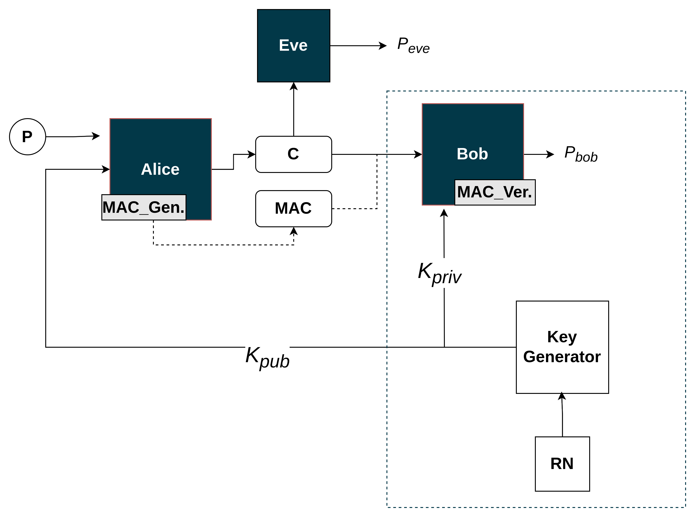

# Adversarial neural cryptography with authenticated encryption

Work in progress with the objective of modeling a sophisticated adversarial neural network that is resistant to all attacks.

- [Model_0](poc_model_0.ipynb)
- [Model_1](model_1.ipynb)
- [Model_leaky](model_leaky.ipynb)
- [Model_mac_symmetric_encryption](model_mac_symmetric.ipynb)

## Reference

[LEARNING TO PROTECT COMMUNICATIONS WITH ADVERSARIAL NEURAL CRYPTOGRAPHY](https://arxiv.org/abs/1610.06918)
